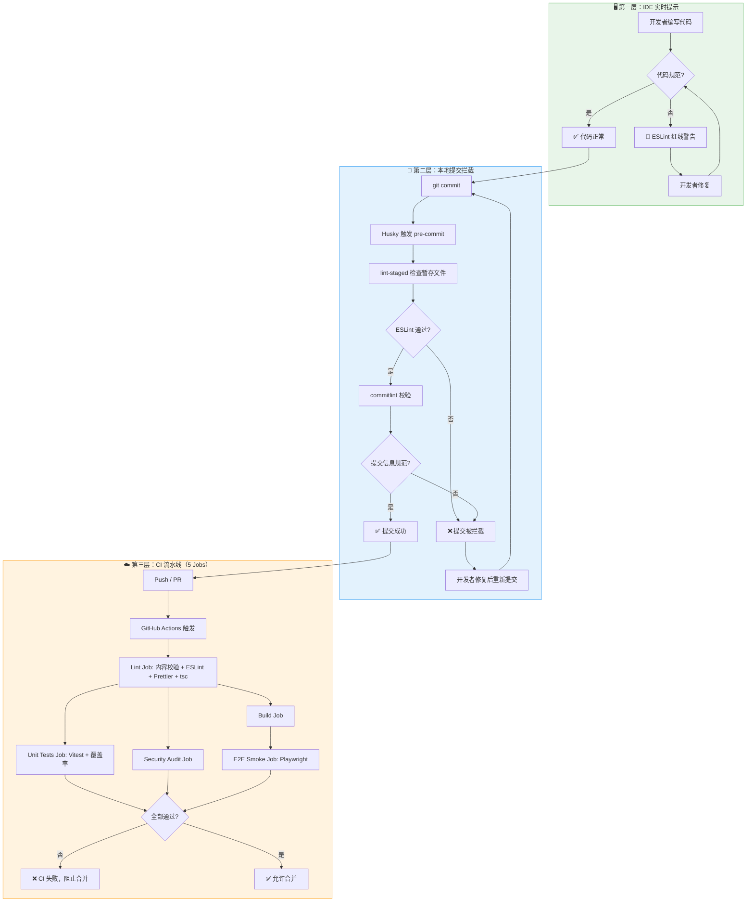

# 贡献指南

感谢你对本项目的贡献兴趣！请在提交代码前仔细阅读以下规范。

## 开发环境

### 环境要求

- **Node.js** 20+（通过 `.nvmrc` 指定）
- **pnpm** 9+（通过 Corepack 自动安装）

### 常用命令

```bash
pnpm install          # 安装依赖
pnpm dev              # 启动开发服务器（自动生成搜索索引与题目加载器）
pnpm lint             # 代码检查
pnpm lint:fix         # 自动修复
pnpm format           # 代码格式化
pnpm validate:content # 校验内容一致性（problem.json 与实际目录）
```

### 测试命令

```bash
pnpm test             # 单元测试
pnpm test:coverage    # 覆盖率报告
pnpm test:e2e:smoke   # Playwright 冒烟测试
pnpm security:audit   # 安全审计
```

### 推荐 VSCode 扩展

打开项目时 VSCode 会自动提示安装，或手动安装：

| 扩展                      | ID                          | 用途              |
| ------------------------- | --------------------------- | ----------------- |
| ESLint                    | `dbaeumer.vscode-eslint`    | 代码检查          |
| Prettier                  | `esbenp.prettier-vscode`    | 代码格式化        |
| EditorConfig              | `editorconfig.editorconfig` | 编辑器配置        |
| Tailwind CSS IntelliSense | `bradlc.vscode-tailwindcss` | Tailwind 智能提示 |
| GitLens                   | `eamodio.gitlens`           | Git 增强          |

## 代码规范

### ESLint & Prettier

本项目使用 ESLint 进行代码质量检查，Prettier 进行代码格式化。提交前请确保代码通过检查：

```bash
pnpm lint:fix   # 自动修复 ESLint 问题
pnpm format     # 格式化代码
```

> **提示**：Git Hook 会在提交时自动运行 lint-staged，对暂存文件进行检查。

---

## Git Commit 规范

本项目严格遵守 **Conventional Commits** 规范，使用 **commitizen** + **cz-git** 进行交互式提交。

### 代码质量保障流程

本项目采用三层代码质量保障机制：



### 提交流程

#### 步骤 1：暂存更改

```bash
git add .                    # 暂存所有更改
# 或
git add <specific-file>      # 暂存特定文件
```

#### 步骤 2：使用交互式提交

```bash
pnpm commit
```

#### 步骤 3：按提示填写信息

```
? 📌 请选择提交类型: feat
? 🎯 请选择影响范围 (可选): components
? 📝 请简要描述更改:
 新增算法可视化卡片组件
? ✅ 确认提交? Yes
```

#### 步骤 4：推送到远程

```bash
git push origin main
```

### 完整提交示例

假设你修改了 `src/components/shared/AlgorithmCard.tsx` 文件：

```bash
# 1. 查看更改
git status

# 2. 暂存文件
git add src/components/shared/AlgorithmCard.tsx

# 3. 交互式提交
pnpm commit

# 交互过程：
# ? 📌 请选择提交类型: feat
# ? 🎯 请选择影响范围 (可选): shared
# ? 📝 请简要描述更改: 新增算法卡片难度标签显示
# ? ✅ 确认提交? Yes

# 4. 推送
git push origin main
```

最终生成的 commit message：

```
feat(shared): :sparkles: 新增算法卡片难度标签显示
```

---

### 提交格式

```
<Type>(<Scope>): <Emoji> <Subject>
```

- **Type**：变更类型（英文小写）
- **Scope**：影响范围（可选，但能推断时建议填写）
- **Emoji**：自动添加，与 Type 对应
- **Subject**：简短中文描述（≤50 字，末尾无标点）

### Type 与 Emoji 对照表

| Emoji | Type       | 描述                         |
| ----- | ---------- | ---------------------------- |
| ✨    | `feat`     | 新增功能                     |
| 🐛    | `fix`      | 修复缺陷                     |
| 📚    | `docs`     | 仅文档变动                   |
| 🎨    | `style`    | 仅代码格式（不影响运行逻辑） |
| 📦    | `refactor` | 重构（不新增功能、不修 bug） |
| 🚀    | `perf`     | 性能优化                     |
| 🧪    | `test`     | 测试用例新增/修改            |
| 👷    | `build`    | 构建系统/依赖变更            |
| 🎡    | `ci`       | CI 配置/脚本变更             |
| 🔧    | `chore`    | 杂项（辅助工具、脚本等）     |
| ⏪    | `revert`   | 回滚                         |
| 🚧    | `wip`      | 开发中                       |
| 📋    | `workflow` | 工作流程改进                 |
| 🏷️    | `types`    | 类型定义文件更改             |
| 🎉    | `release`  | 发布新版本                   |

### Scope 选项

本项目预设以下 Scope，基于目录结构：

| Scope        | 对应目录                    | 说明             |
| ------------ | --------------------------- | ---------------- |
| `app`        | `src/app`                   | Next.js 页面路由 |
| `components` | `src/components`            | 通用组件         |
| `ui`         | `src/components/ui`         | UI 基础组件      |
| `visualizer` | `src/components/visualizer` | 可视化组件       |
| `shared`     | `src/components/shared`     | 共享组件         |
| `lib`        | `src/lib`                   | 工具库           |
| `problems`   | `src/lib/problems`          | 算法题目         |
| `hooks`      | `src/lib/hooks`             | 自定义 Hooks     |
| `store`      | `src/lib/store`             | 状态管理         |
| `types`      | `src/types`                 | 类型定义         |
| `docs`       | -                           | 文档相关         |
| `build`      | -                           | 构建配置         |

> 💡 也可以选择「跳过」或「自定义」Scope。

### Subject 规则

1. 必须是**动作 + 对象 + 结果/问题**的短句
2. **禁止末尾标点**（`。！？…` 都不允许）
3. **禁止超 50 字**
4. 专有名词可保留英文

### 正确示例

```
feat(shared): :sparkles: 新增按钮禁用态样式与交互
fix(problems): :bug: 修复岛屿数量算法边界条件错误
refactor(lib): :package: 重构帧生成逻辑以减少重复代码
docs(docs): :books: 更新 README 项目说明
build(build): :construction_worker: 升级 Next.js 到 16.1.1
```

### 错误示例

```
❌ Update files                        # 过于笼统
❌ fix: fixed bug                      # 缺 Emoji、Subject 非中文且不具体
❌ ✨ 新功能: 增加列表                  # Type 必须是英文
❌ 🐛 fix(login): 修复问题。           # 末尾句号不允许
```

---

## 添加新算法

这是本项目最常见的贡献方式。每个算法是一个自包含的模块，位于 `src/lib/problems/<category>/<algorithm-slug>/`。

### 模块结构

```
<algorithm-slug>/
├── types.ts          # 类型定义（枚举、接口、帧结构）
├── constants.ts      # 常量配置（模式、代码片段、图例、默认输入）
├── frames.ts         # 帧生成函数（核心算法可视化逻辑）
├── index.tsx         # AlgorithmConfig 导出 + 渲染器组件
└── solution.md       # 中文题解（支持 KaTeX 数学公式）
```

### 流程

1. 在对应分类目录下创建算法文件夹（命名为 kebab-case）
2. 实现 `types.ts` → `constants.ts` → `frames.ts` → `index.tsx` → `solution.md`
3. 在 `src/lib/problems/<category>/problem.json` 中添加题目元数据
4. 在 `src/lib/problems/<category>/index.ts` 中导出配置
5. 在 `src/lib/problems/index.ts` 的 `ALGORITHM_REGISTRY` 中注册
6. 运行 `pnpm dev` 验证（自动生成搜索索引与加载器）

> 详细规范参见 README.md 中的「添加新算法」章节。

---

## Pull Request 规范

1. PR 标题遵循 Commit 规范格式
2. 在 PR 描述中清晰说明改动内容和原因
3. 确保所有 CI 检查通过（5 个 Job：Lint、Unit Tests、Security Audit、Build、E2E Smoke）
4. 新增算法时，运行 `pnpm validate:content` 确保元数据一致性
5. 如有 UI 变更，请附上截图

## 问题反馈

如有问题或建议，请通过 [Issues](../../issues) 反馈。
