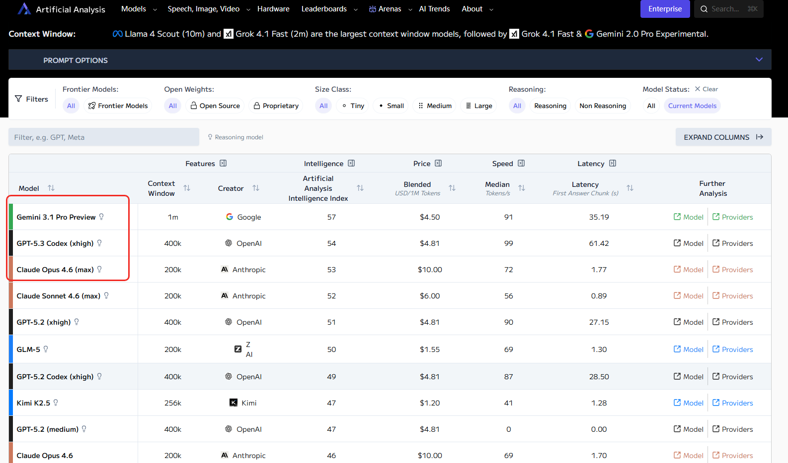

# Bare Algo 朴素算法

[Bare Algo](https://www.barealgo.com/) 的灵感来自 Google AI Studio 的 [Build your ideas with Gemini](https://aistudio.google.com/u/1/apps)。因为自己并不是那种一眼就能看懂算法的大佬，刷题时经常卡在‘题解看懂了字，却没真正看懂思路’这一步，所以开始尝试借助 AI 帮助自己拆解推理过程。

后来又发现，单靠文字讲解还是不够直观，于是就用动画去呈现算法的每一步，这才慢慢有了搭建这个算法可视化平台的想法。

做着做着，又意识到单单会算法也不够，算法如何结合真实场景、如何解决实际问题，同样也需要深入理解，所以后续也会陆续加入更多算法与实际应用结合的内容。

要是也有认同这件事、愿意一起完善它的人加入，那就更好了。

> 说明：项目目前以 **TypeScript** 为主。如果你需要 Python、Java、C++ 等版本，可以直接复制代码，交给你常用的 AI 工具一键转换。

## 🌐 线上体验

**访问地址**：[barealgo.com](https://www.barealgo.com/)

## 🤖 AI 驱动开发

<p align="center">
  <a href="https://claude.ai"></a>
  <a href="https://chat.openai.com"></a>
  <a href="https://gemini.google.com"></a>
</p>
<p align="center"><sub>本项目由以上三个 AI 编程助手协助开发，分别是 Claude Opus 4.6 (Thinking)、GPT-5.3 Codex (xhigh) 和 Gemini 3.1 Pro (High)</sub></p>

<details>
<summary>📊 <b>AI 模型排行榜</b>（数据来源：<a href="https://artificialanalysis.ai/leaderboards/models">Artificial Analysis</a>，截至 2026-02-27）</summary>
<p align="center">
  
</p>
</details>

---

## ✨ 核心特性

- **23 分类全覆盖**：数组、链表、哈希表、二叉树、图论、动态规划、位运算、Trie、线段树、并查集等主流算法板块，另有 **LeetCode 热题 100** 精选合集
- **逐帧可视化播放器**：播放 / 暂停 / 步进 / 进度拖拽 / 多倍速（0.5x–4x），像看动画一样理解每一步
- **多解法对比**：同一道题支持多种算法模式（如 DFS vs BFS vs 并查集），一键切换
- **代码同步高亮**：播放到哪一帧，代码对应行自动高亮，帧消息实时显示
- **Markdown 题解**：支持 KaTeX 数学公式与 GFM 表格的完整题解
- **真实业务 Demo**：账号合并检测、课程依赖分析等，连接算法与实际应用
- **全局搜索**：`Ctrl+K` 快速搜索题目，秒速定位
- **响应式设计**：移动竖屏悬浮条 + 抽屉，横屏 / 桌面 7:5 双栏，全平台体验一致
- **自动缩放**：`<ScaleToFit>` 容器确保可视化画布在任意屏幕不溢出
- **PR 贡献引导**：当算法尚未实现时，友好的"敬请期待"页面引导用户直接提交 PR 或通过 AI 工具自助生成
- **安全审计**：内置一站式安全检查脚本（依赖漏洞 + 密钥检测 + 许可证合规 + 安全头验证）

---

## 🛠️ 技术栈

| 类别      | 技术                                     |
| --------- | ---------------------------------------- |
| 框架      | Next.js 16 (App Router) + React 19       |
| 语言      | TypeScript 5 (strict)                    |
| 样式      | Tailwind CSS 4 + shadcn/ui               |
| 动画      | Framer Motion                            |
| 状态管理  | Zustand                                  |
| 代码高亮  | React Syntax Highlighter                 |
| Markdown  | React Markdown + remark-gfm + KaTeX 数学 |
| 代码规范  | ESLint 9 + Prettier                      |
| 提交规范  | Commitlint + Commitizen + cz-git         |
| Git Hooks | Husky + lint-staged                      |
| CI/CD     | GitHub Actions                           |
| 性能测试  | Lighthouse + Playwright Core             |

---

## 🚀 快速开始

### 环境要求

- **Node.js** 20+ (通过 `.nvmrc` 指定)
- **pnpm** 9+ (推荐)

### 安装与运行

```bash
# 克隆仓库
git clone https://github.com/Harvey-Andrew/bare-algorithm.git
cd bare-algorithm

# 安装依赖
pnpm install

# 启动开发服务器（自动生成搜索索引与题目加载器）
pnpm dev
```

访问 http://localhost:3000 查看效果。

### 常用命令

```bash
pnpm dev              # 开发模式（含预生成）
pnpm build            # 生产构建
pnpm start            # 启动生产服务
pnpm lint             # 代码检查
pnpm lint:fix         # 自动修复
pnpm format           # 格式化代码
pnpm format:check     # 检查格式
pnpm commit           # 交互式 Git 提交
pnpm validate:content # 内容一致性校验
pnpm oss:export       # 导出公开仓库快照到 bare-algorithm/（增量同步，保留 .git）
```

### Bundle 体积分析

```bash
pnpm bundle:analyze:before   # 优化前构建 + 快照
pnpm bundle:analyze:after    # 优化后构建 + 快照
pnpm bundle:compare          # 生成 before vs after 对比可视化报告
pnpm bundle:refresh:compare  # 一键重新构建并对比
```

---

## 📁 项目结构

```
bare-algo/
├── src/
│   ├── app/                              # Next.js App Router
│   │   ├── layout.tsx                    # 全局布局（Navbar + 安全区）
│   │   ├── page.tsx                      # 首页 Hero
│   │   ├── globals.css                   # Tailwind + 算法 CSS 变量
│   │   ├── demo/                         # 业务场景 Demo 页
│   │   └── problems/
│   │       ├── page.tsx                  # 算法分类总览
│   │       └── [category]/
│   │           ├── page.tsx              # 分类题目列表
│   │           └── [slug]/
│   │               └── page.tsx          # 题目可视化 + 题解页
│   │
│   ├── components/
│   │   ├── ui/                           # shadcn/ui 基础组件
│   │   ├── shared/                       # 共享业务组件
│   │   │   ├── ClientNavbar.tsx          # 响应式导航栏
│   │   │   ├── VisualizerLayout.tsx      # 可视化器三模式布局
│   │   │   ├── UnifiedPlayerControls.tsx # 统一播放器控件
│   │   │   ├── CodePanel.tsx             # 代码高亮面板
│   │   │   ├── FloatingCodeBar.tsx       # 移动端悬浮执行行
│   │   │   ├── ScaleToFit.tsx            # 通用自适应缩放容器
│   │   │   ├── SearchDialog.tsx          # 全局搜索弹窗
│   │   │   ├── BackButton.tsx            # 智能返回按钮
│   │   │   └── ...                       # 更多共享组件
│   │   └── visualizer/
│   │       └── GenericVisualizer.tsx      # 通用可视化渲染引擎
│   │
│   ├── lib/
│   │   ├── problems/                     # 算法模块（核心）
│   │   │   ├── categories.json           # 分类元数据
│   │   │   ├── index.ts                  # 算法注册表
│   │   │   ├── search-data.json          # 搜索索引（自动生成）
│   │   │   ├── problem-loaders.generated.ts # 动态加载器（自动生成）
│   │   │   ├── leetcode-hot-100/          # LeetCode 热题 100
│   │   │   ├── array/                    # 数组
│   │   │   ├── linked-list/              # 链表
│   │   │   ├── hash-table/               # 哈希表
│   │   │   ├── dynamic-programming/      # 动态规划
│   │   │   ├── graph/                    # 图论
│   │   │   └── ...                       # 更多分类
│   │   ├── hooks/
│   │   │   ├── useAlgoPlayer.ts          # 播放器核心 Hook
│   │   │   └── useOrientation.ts         # 屏幕方向检测 Hook
│   │   ├── store/
│   │   │   └── playerStore.ts            # Zustand 全局状态
│   │   └── utils.ts                      # 工具函数
│   │
│   └── types/                            # TypeScript 类型定义
│
├── scripts/                              # 工具脚本
│   ├── generate-search-data.mjs          # 搜索索引生成
│   ├── generate-problem-loaders.mjs      # 题目加载器生成
│   ├── validate-content-consistency.mjs  # 内容一致性校验
│   ├── security-audit.mjs                # 安全审计脚本
│   ├── test-report-visualize.mjs         # 测试报告可视化
│   ├── bundle-snapshot.mjs               # Bundle 体积快照
│   ├── bundle-compare-visualize.mjs      # Bundle 对比可视化
│   ├── perf-lighthouse.ps1               # Lighthouse 基准扫描
│   ├── perf-interactive-drilldown.ps1    # 交互式性能深挖
│   ├── perf-drilldown-auto.mjs           # Playwright 自动深挖
│   ├── perf-report-visualize.mjs         # 性能报告可视化
│   └── perf-scenarios.json               # 性能测试场景配置
│
├── docs/                                 # 项目文档
│   ├── ui/                               # UI 与适配文档
│   ├── performance/                      # 性能优化工作流
│   ├── testing/                          # 测试报告与策略
│   ├── security/                         # 安全审计报告
│   ├── environment/                      # 开发环境文档
│   └── prompts/                          # AI 辅助提示词
│
└── 工程化配置
    ├── .nvmrc                            # Node 版本锁定
    ├── .npmrc                            # pnpm 配置
    ├── eslint.config.mjs                 # ESLint 9 Flat Config
    ├── commitlint.config.js              # 提交信息规范
    ├── .lintstagedrc.json                # 暂存检查
    ├── .husky/                           # Git Hooks
    └── .github/workflows/               # CI/CD
```

---

## 🏗️ 核心架构

### 设计原则

**算法配置驱动渲染**——每个算法都是一个自包含的模块（文件夹），包含配置、帧生成逻辑、类型定义和 Markdown 题解。通用渲染引擎 `GenericVisualizer` 根据配置自动完成播放、高亮和交互。

```
AlgorithmConfig ──▶ generateFrames() ──▶ Frame[] ──▶ GenericVisualizer
   (配置对象)         (帧生成函数)       (快照序列)     (通用渲染器)
```

### AlgorithmConfig 接口

```typescript
interface AlgorithmConfig<TInput, TFrame extends BaseFrame> {
  id: string; // 算法 ID
  title: string; // 显示标题
  externalLinks: string; // LeetCode 链接
  modes: ModeConfig[]; // 解法模式（支持多种）
  defaultMode: string; // 默认模式
  defaultInput: TInput; // 默认输入
  legend: LegendItem[]; // 颜色图例

  // 核心函数
  formatInput: (input: TInput) => string;
  parseInput: (value: string) => TInput | null;
  generateRandomInput: () => TInput;
  generateFrames: (input: TInput, mode: string) => TFrame[];

  // 渲染函数
  RendererVisualizer: (props: VisualizerRenderProps<TFrame>) => ReactNode;
  renderCodePanel: (props: CodePanelRenderProps<TFrame>) => ReactNode;
}
```

---

## ➕ 添加新算法

### Step 1：创建算法目录

```
src/lib/problems/{category}/{algorithm-slug}/
├── index.tsx        # 配置入口（导出 AlgorithmConfig）
├── constants.ts     # 常量（代码字符串、图例、模式定义）
├── frames.ts        # 帧生成逻辑（核心算法 + 录制快照）
├── types.ts         # 类型定义（输入类型、帧类型）
└── solution.md      # 中文题解（支持 KaTeX 数学公式）
```

### Step 2：实现配置

```typescript
// index.tsx
import { findProblemMeta } from '@/lib/problems/problem-data';
import problemData from '../problem.json';

const problem = findProblemMeta(problemData as unknown[], 'my-algorithm')!;

export const myAlgorithmConfig: AlgorithmConfig<MyInput, MyFrame> = {
  id: problem.id,
  title: problem.title,
  externalLinks: problem.externalLinks,
  modes: [
    { value: 'dfs', label: 'DFS', icon: Search },
    { value: 'bfs', label: 'BFS', icon: Layers },
  ],
  defaultMode: 'dfs',
  generateFrames: (input, mode) => generateMyFrames(input, mode),
  RendererVisualizer: (props) => <MyRenderer {...props} />,
  renderCodePanel: (props) => <CodePanel {...props} />,
  // ...其他字段
};
```

### Step 3：注册算法

```typescript
// src/lib/problems/{category}/index.ts
export { myAlgorithmConfig } from './my-algorithm';

// src/lib/problems/index.ts 中添加到 ALGORITHM_REGISTRY
```

### Step 4：添加题目元数据

```json
// src/lib/problems/{category}/problem.json
[
  {
    "id": "stage-1",
    "title": "第 1 阶段：阶段标题",
    "description": "阶段描述",
    "problems": [
      {
        "id": "my-algorithm",
        "title": "123. 算法标题",
        "difficulty": "medium",
        "description": "题目描述",
        "tags": ["标签1", "标签2"],
        "externalLinks": "https://leetcode.cn/problems/xxx/",
        "category": "{category}"
      }
    ]
  }
]
```

---

## 🎮 播放器功能

| 功能         | 说明                |
| ------------ | ------------------- |
| ▶️ 播放/暂停 | 自动播放帧序列      |
| ⏮️ 上一步    | 回退一帧            |
| ⏭️ 下一步    | 前进一帧            |
| ⏪ 第一步    | 跳到首帧            |
| ⏩ 最后一步  | 跳到末帧            |
| 🔄 重置      | 重置到初始状态      |
| 进度条       | 拖拽跳转到任意帧    |
| 速度控制     | 0.5x / 1x / 2x / 4x |

---

## 📱 移动端适配

项目采用 **Mobile First** 设计，通过 Tailwind 响应式前缀实现三套自动切换的布局模式：

| 模式       | 触发条件        | 布局方案                    |
| ---------- | --------------- | --------------------------- |
| 竖屏移动端 | `portrait` 手机 | 可视化全屏 + 底部悬浮执行行 |
| 桌面端     | `lg+` 宽屏      | 7:5 直接双栏                |

关键组件：

- `FloatingCodeBar`：竖屏底部悬浮条，点击展开代码抽屉
- `ScaleToFit`：可视化画布自动缩放（仅缩小不放大）
- `useOrientation`：实时监测屏幕方向

> 详细改动清单见 [docs/ui/屏幕适配.md](./docs/ui/屏幕适配.md)

---

## 🧪 测试与质量工具链

### 单元测试 & 端到端测试

```bash
pnpm test                  # 运行单元测试
pnpm test:coverage         # 生成覆盖率报告
pnpm test:e2e:smoke        # Playwright 冒烟测试
pnpm test:workflow         # 一键完整测试流水线（单元 → E2E → 可视化报告）
pnpm test:report:visualize # 生成测试结果可视化报告
```

### 安全审计

```bash
pnpm security:audit        # 一站式安全检查（依赖漏洞 + 密钥检测 + 许可证合规 + 安全头验证）
pnpm security:audit:ci     # CI 模式（失败时退出码非零）
```

### 性能测试

项目内置了完整的性能测试 & 报告工具链（仅支持 Windows PowerShell）：

```bash
# Lighthouse 基准扫描（4 路由，含结果校验）
powershell -ExecutionPolicy Bypass -File .\scripts\perf-lighthouse.ps1 -OutDir docs/performance/baseline -Port 3000

# 交互式性能深挖（Playwright 自动交互 + Trace/HAR/截图）
pnpm perf:drilldown

# 生产模式深挖（先 next build 再采样，减少 dev 噪声）
powershell -ExecutionPolicy Bypass -File .\scripts\perf-interactive-drilldown.ps1 -Port 3000 -Mode prod

# 生成 baseline vs optimized 对比可视化报告
pnpm perf:report:visualize

# 全流程一键：baseline → optimized → 报告 → 深挖
pnpm perf:full
```

> 详细工作流见 [docs/performance/性能分析工作流.md](./docs/performance/性能分析工作流.md)

---

## 🎨 样式系统

### 算法专用 CSS 变量

```css
/* src/app/globals.css */

/* 强调色 */
--algo-primary: oklch(0.7 0.2 260);
--algo-primary-glow: oklch(0.7 0.2 260 / 30%);

/* 元素状态色 */
--algo-default: oklch(0.3 0.02 260); /* 默认 */
--algo-active: oklch(0.6 0.25 260); /* 当前操作 */
--algo-comparing: oklch(0.75 0.2 80); /* 比较中 */
--algo-success: oklch(0.7 0.2 145); /* 已完成 */
--algo-error: oklch(0.65 0.25 25); /* 错误 */
--algo-visited: oklch(0.5 0.15 300); /* 已访问 */
```

---

## ⚙️ 工程化配置

| 文件                     | 说明                                          |
| ------------------------ | --------------------------------------------- |
| `.editorconfig`          | 跨编辑器统一配置                              |
| `.vscode/`               | VSCode 项目配置与推荐扩展                     |
| `.nvmrc`                 | 指定 Node.js 版本（20.18.0）                  |
| `.npmrc`                 | pnpm 配置（详见下方）                         |
| `commitlint.config.js`   | 提交信息规范（15 种 type + 12 种 scope）      |
| `.lintstagedrc.json`     | 暂存文件检查                                  |
| `.husky/`                | Git Hooks（pre-commit + commit-msg）          |
| `.github/workflows/`     | CI/CD（ci + oss-sync + release + stale + labeler） |
| `.github/dependabot.yml` | 自动依赖更新（npm + GitHub Actions，每周/月） |

### `.npmrc` 配置详解

```ini
engine-strict=true        # 强制校验 engines 字段（Node ≥ 20, pnpm ≥ 9）
auto-install-peers=true   # 自动安装 peerDependencies
save-exact=false          # 安装时保留语义版本范围前缀（^/~）
shamefully-hoist=true     # 兼容非严格 ESM 包的隐式依赖提升
lockfile=true             # 启用 pnpm-lock.yaml 锁文件
```

> **国内网络加速**：如果 `pnpm install` 出现 `ECONNRESET` 或下载缓慢，建议切换为国内镜像源：
>
> ```bash
> pnpm config set registry https://registry.npmmirror.com
> ```

---

## 📚 文档索引

| 文档                                                                                 | 说明                     |
| ------------------------------------------------------------------------------------ | ------------------------ |
| [项目配置说明](./docs/项目配置说明.md)                                               | 所有配置文件详细说明     |
| [测试框架工作流](./docs/testing/测试框架工作流.md)                                   | 单元测试与 E2E 测试 SOP  |
| [性能分析工作流](./docs/performance/性能分析工作流.md)                               | Lighthouse + 深挖 SOP    |
| [安全审计工作流](./docs/security/安全审计工作流.md)                                  | 自动化安全检查与合规 SOP |
| [屏幕适配](./docs/ui/屏幕适配.md)                                                    | 移动端/桌面端适配方案    |
| [返回按钮智能导航机制](./docs/ui/返回按钮智能导航机制.md)                            | BackButton 设计与实现    |
| [开发环境-异步边界报错修复说明](./docs/environment/开发环境-异步边界报错修复说明.md) | Next.js 异步边界修复     |
| [开源 (OSS) 导出工作流](./docs/environment/开源%20(OSS)%20导出工作流.md)            | 公开仓库导出与同步流程   |
| [算法可视化帧生成模式设计](./docs/算法可视化帧生成模式设计.md)                       | 状态快照与函数式推帧模式 |
| [CONTRIBUTING.md](./CONTRIBUTING.md)                                                 | 贡献指南                 |

---

## 🤝 贡献指南

详见 [CONTRIBUTING.md](./CONTRIBUTING.md)

---

## 💖 赞助支持

如果这个开源项目对你有所启发或帮助，欢迎请作者喝杯咖啡 ☕️
你的支持是我持续维护和产出高质量开源项目的最大动力！

<p align="center">
  
</p>

---

## 📄 License

[MIT](./LICENSE) © 2025 Harvey
