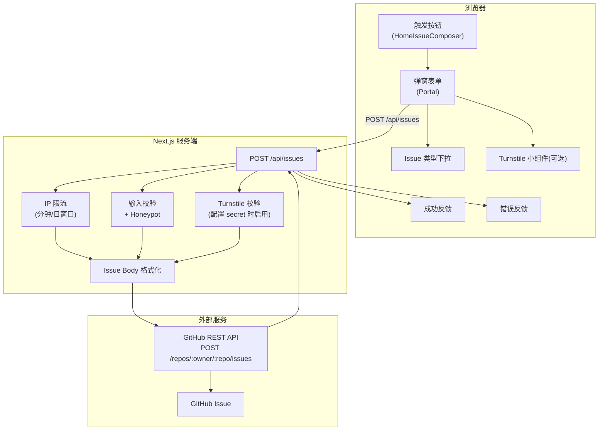
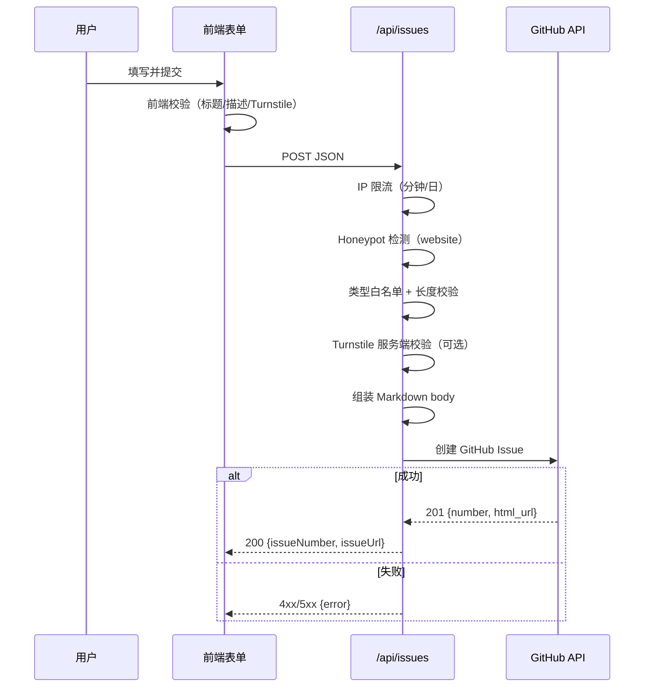

# 站内 Issue 提交系统架构说明（2026-03-11）

> 目标：用户无需跳转 GitHub，在站内完成反馈提交；服务端代理创建 GitHub Issue，并提供基础防刷能力。

---

## 1. 整体架构

---

## 2. 关键文件

| 文件                                          | 角色                                                     |
| --------------------------------------------- | -------------------------------------------------------- |
| `src/app/api/issues/route.ts`                 | 服务端入口：限流、校验、防刷、代理调用 GitHub            |
| `src/components/issues/HomeIssueComposer.tsx` | 前端入口：弹窗、字段校验、Turnstile token 提交、反馈提示 |

---

## 3. 环境变量

| 变量名                            | 必填 | 用途                             |
| --------------------------------- | ---- | -------------------------------- |
| `GITHUB_TOKEN`                    | 是   | 服务端调用 GitHub API 创建 Issue |
| `GITHUB_ISSUE_REPO`               | 否   | 指定目标仓库（优先级最高）       |
| `NEXT_PUBLIC_GISCUS_REPO`         | 否   | 目标仓库回退值                   |
| `ISSUE_RATE_LIMIT_MAX_PER_MINUTE` | 否   | 单 IP 每分钟提交上限（默认 3）   |
| `ISSUE_RATE_LIMIT_MAX_PER_DAY`    | 否   | 单 IP 每日提交上限（默认 20）    |
| `NEXT_PUBLIC_TURNSTILE_SITE_KEY`  | 否   | 前端 Turnstile site key          |
| `TURNSTILE_SECRET_KEY`            | 否   | 服务端 Turnstile secret key      |

说明：

- 仅配置 `NEXT_PUBLIC_TURNSTILE_SITE_KEY` 时，前端会渲染验证组件；
- 仅配置 `TURNSTILE_SECRET_KEY` 时，后端会强制校验 token；
- 两者均配置才是完整强校验路径。

---

## 4. 请求链路

---

## 5. 字段与约束

| 字段             | 约束                                    |
| ---------------- | --------------------------------------- |
| `type`           | 必须在固定枚举内                        |
| `title`          | 6-256 字符                              |
| `description`    | 12-65536 字符                           |
| `reproduction`   | 可选                                    |
| `expected`       | 可选                                    |
| `contact`        | 可选                                    |
| `website`        | honeypot 字段，非空即拒绝               |
| `turnstileToken` | 开启 Turnstile 时必填且需通过服务端验证 |

---

## 6. 错误码语义

| 状态码 | 含义                                         |
| ------ | -------------------------------------------- |
| `400`  | 请求体不合法 / 字段不合法 / Turnstile 未通过 |
| `429`  | 触发 IP 限流（含 `Retry-After`）             |
| `500`  | 服务端配置异常（如仓库格式非法）             |
| `502`  | GitHub API 调用失败或权限不足                |
| `503`  | 未配置 `GITHUB_TOKEN`                        |

---

## 7. 防护策略

| 策略       | 说明                                |
| ---------- | ----------------------------------- |
| Token 隔离 | `GITHUB_TOKEN` 仅服务端可见         |
| Honeypot   | 低成本拦截基础机器人                |
| IP 限流    | 分钟窗口 + 日窗口双重限制           |
| Turnstile  | 对抗自动化提交（可选启用）          |
| 输入校验   | 类型白名单 + 长度限制 + trim 归一化 |

---

## 8. 当前边界与后续优化

1. 当前限流为进程内内存桶，多实例部署下不共享计数。
2. 建议后续接入分布式限流（Redis/KV）保证全局一致。
3. 建议配合告警日志记录 `429` 命中率和 Turnstile 失败率，用于阈值调优。
