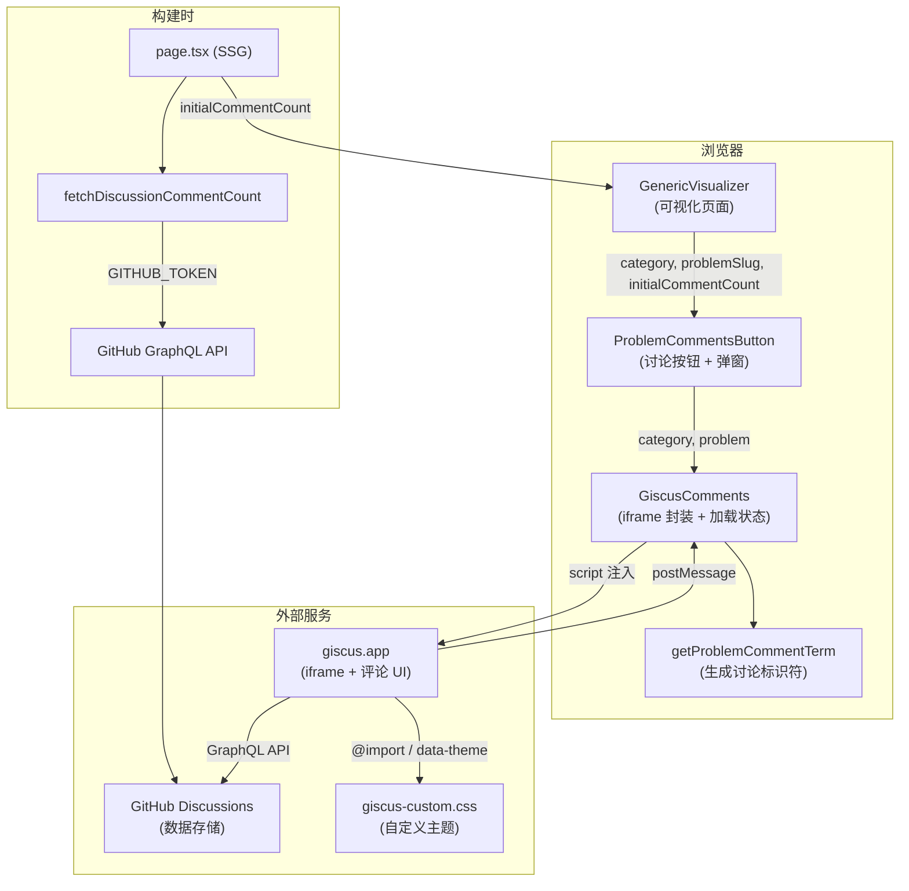
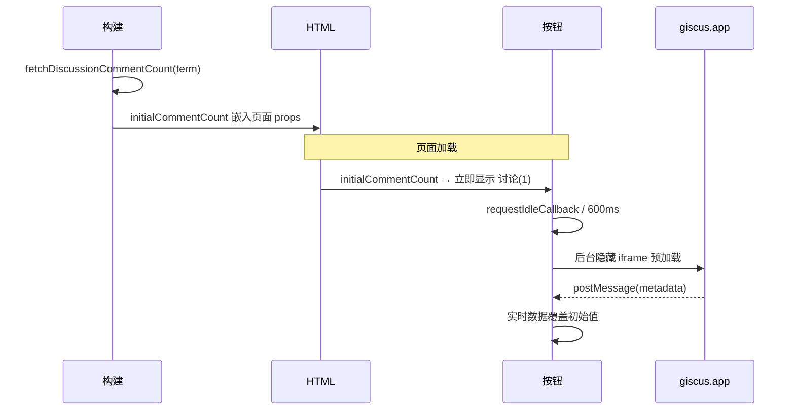
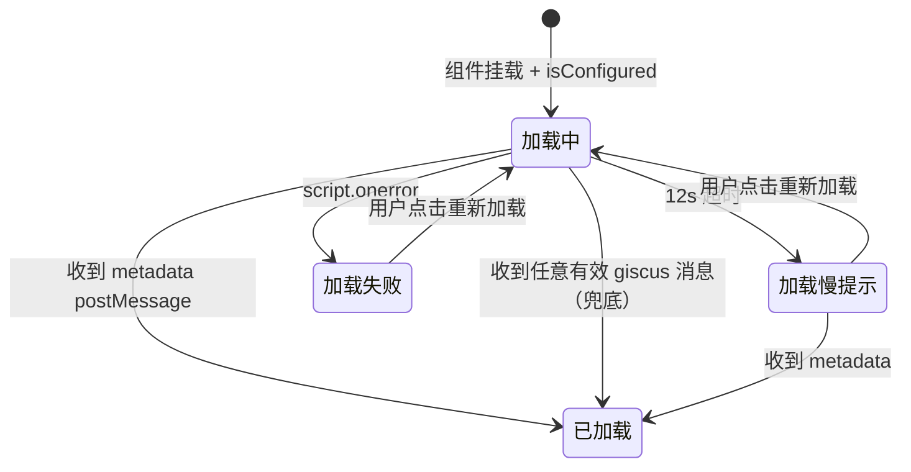
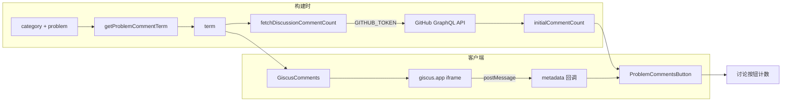

# 题目讨论系统架构说明

> 基于 [giscus](https://giscus.app/) 实现，利用 GitHub Discussions 作为数据存储，每道算法题拥有独立讨论线程。

---

## 整体架构



---

## 文件清单

| 文件                                                                                                                                            | 职责                                                         |
| ----------------------------------------------------------------------------------------------------------------------------------------------- | ------------------------------------------------------------ |
| [fetch-discussion-count.ts](file:///c:/my-project/web-promote/code/algorithm-visualization/src/lib/comments/fetch-discussion-count.ts)          | **服务端**：GitHub GraphQL API 查询 Discussion 评论数        |
| [problem-comment-thread.ts](file:///c:/my-project/web-promote/code/algorithm-visualization/src/lib/comments/problem-comment-thread.ts)          | 生成讨论标识符 `problem:{category}/{problem}`                |
| [GiscusComments.tsx](file:///c:/my-project/web-promote/code/algorithm-visualization/src/components/comments/GiscusComments.tsx)                 | 核心组件：giscus iframe 封装、消息解析、加载状态管理、骨架屏 |
| [ProblemCommentsSection.tsx](file:///c:/my-project/web-promote/code/algorithm-visualization/src/components/comments/ProblemCommentsSection.tsx) | 入口组件：讨论按钮、弹窗容器、预加载策略、评论计数           |
| [globals.css](file:///c:/my-project/web-promote/code/algorithm-visualization/src/app/globals.css#L600-L639)                                     | giscus 外层 CSS：iframe 尺寸铺满 + shimmer 动画              |
| [giscus-custom.css](file:///c:/my-project/web-promote/code/algorithm-visualization/public/giscus-custom.css)                                    | iframe 内部自定义主题：内边距 + 隐藏默认加载动画             |

---

## 环境变量

| 变量名                           | 示例值                         | 用途                                                                 |
| -------------------------------- | ------------------------------ | -------------------------------------------------------------------- |
| `GITHUB_TOKEN`                   | `ghp_xxx...`                   | **服务端专用**，构建时查询 GitHub Discussions API 获取评论计数       |
| `NEXT_PUBLIC_GISCUS_REPO`        | `Harvey-Andrew/bare-algorithm` | 绑定的 GitHub 仓库                                                   |
| `NEXT_PUBLIC_GISCUS_REPO_ID`     | `R_kgDORdNOJw`                 | 仓库 ID（giscus 配置页获取）                                         |
| `NEXT_PUBLIC_GISCUS_CATEGORY`    | `Problem Comments`             | GitHub Discussions 分类名                                            |
| `NEXT_PUBLIC_GISCUS_CATEGORY_ID` | `DIC_kwDORdNOJ84C3ovm`         | 分类 ID                                                              |
| `NEXT_PUBLIC_GISCUS_LANG`        | `zh-CN`                        | giscus 界面语言                                                      |
| `NEXT_PUBLIC_SITE_URL`           | `https://your-domain.com`      | 站点 URL（用于自定义主题 CSS URL，localhost 时回退为内置 dark 主题） |

> [!IMPORTANT]
> `GITHUB_TOKEN` 需要 `public_repo` 或 `read:discussion` 权限，**不加** `NEXT_PUBLIC_` 前缀，仅服务端可见。
> 未配置时评论计数回退为客户端延迟加载，不影响功能。

---

## 评论计数双层架构

讨论按钮上的评论计数由**两层数据源**驱动，实现「首屏即可见 + 后续实时更新」：



| 阶段          | 数据来源                                       | 延迟                      |
| ------------- | ---------------------------------------------- | ------------------------- |
| 页面首屏      | `initialCommentCount`（构建时 GitHub API）     | **0ms**，随 HTML 一起到达 |
| giscus 加载后 | `metadata.totalCommentCount + totalReplyCount` | 1~3s（客户端 iframe）     |

### 服务端查询（`fetchDiscussionCommentCount`）

- 使用 GitHub GraphQL `search` API 按 `term` 匹配 Discussion
- 仅返回 `comments.totalCount`（不含 replies）
- 缓存 `revalidate: 3600`（1 小时），避免频繁调用
- 无 token / 网络异常时返回 `0` 不阻塞构建

### 组件链路透传

```
page.tsx (SSG) → ProblemVisualizerClient → GenericVisualizer → ProblemCommentsButton
                    ↑ initialCommentCount prop 逐层透传
```

`ProblemCommentsButton` 中的计数逻辑：

```typescript
const totalMessages = metadata
  ? metadata.totalCommentCount + metadata.totalReplyCount // giscus 实时数据
  : (initialCommentCount ?? 0); // 服务端预取
```

---

## 组件详细说明

### 1. `getProblemCommentTerm(category, problem)`

返回 `problem:{category}/{problem}` 作为 giscus `data-term`，一道题对应一个 Discussion 线程。

```
getProblemCommentTerm('array', 'two-sum')  // → "problem:array/two-sum"
```

---

### 2. `ProblemCommentsButton`（入口组件）

#### 核心能力

| 能力             | 实现方式                                                             |
| ---------------- | -------------------------------------------------------------------- |
| **服务端计数**   | 接收 `initialCommentCount` prop，首屏即显示 `讨论(N)`                |
| **客户端预加载** | `requestIdleCallback` 后台渲染 giscus iframe，拉取实时数据覆盖初始值 |
| **评论计数**     | `totalCommentCount + totalReplyCount`，>99 显示 `99+`                |
| **弹窗容器**     | Portal 渲染：遮罩层 + 居中对话框 + 关闭按钮 + Escape 键关闭          |
| **滚动锁定**     | 弹窗打开时锁定 `body` overflow，补偿滚动条宽度防抖                   |
| **登录状态**     | 按钮 tooltip 显示 GitHub 登录用户名                                  |

> [!NOTE]
> 预加载 iframe 和弹窗内 iframe 使用不同的 `key`（`${term}-dialog`），是两个独立的 giscus 实例。

---

### 3. `GiscusComments`（核心组件）

#### 状态机



#### 状态变量

| 变量           | 类型             | 含义                                               |
| -------------- | ---------------- | -------------------------------------------------- |
| `loadedTerm`   | `string \| null` | `loaded = loadedTerm === term`                     |
| `failedTerm`   | `string \| null` | `loadError = failedTerm === term`                  |
| `timedOutTerm` | `string \| null` | `isSlowLoading = !loaded && timedOutTerm === term` |
| `retryNonce`   | `number`         | 自增触发 useEffect 重挂载                          |

> [!TIP]
> 使用 `term` 比对而非布尔值管理状态，切换题目时所有状态自动失效。

#### giscus 消息处理

| 消息类型                      | 处理                            |
| ----------------------------- | ------------------------------- |
| 包含 `discussion` 对象        | 解析 metadata，标记已加载       |
| `discussion === null`         | 零计数 metadata（新题目无线程） |
| 错误含 `discussion/not found` | 视为正常，标记已加载            |
| 错误含 `session/unauthorized` | 通知上层 session 失效           |
| 其他有效消息                  | 兜底标记已加载                  |

#### 加载 UI 状态

| 状态                | 显示                                           |
| ------------------- | ---------------------------------------------- |
| **加载中**          | 骨架屏 + shimmer 光扫动画                      |
| **加载较慢**（12s） | 骨架屏 + 提示条「讨论加载较慢…」+ 重新加载按钮 |
| **加载失败**        | 居中提示「讨论模块加载失败」+ 重新加载按钮     |
| **未配置**          | 黄色提示「讨论系统尚未完成配置」               |
| **已加载**          | giscus iframe 300ms 淡入                       |

#### 重试机制

`handleRetry` 递增 `retryNonce` → 触发 useEffect 重新执行 → 清空标记 + 重新注入 `<script>`。

---

### 4. 自定义主题 CSS

#### iframe 外层（`globals.css`）

```css
.giscus-host, .giscus   → display: flex; flex: 1; min-height: 100%
.giscus-frame            → height: 100% !important; min-height: 500px; flex: 1
```

shimmer 动画 `@keyframes giscus-shimmer` 也定义在此。

#### iframe 内层（`giscus-custom.css`）

```css
@import url('https://giscus.app/themes/dark.css');
.gsc-main {
  padding: 4px 16px 8px;
}
.gsc-loading {
  display: none !important;
}
```

通过 `data-theme` 传入 CSS URL。本地开发回退为内置 `dark` 主题。

---

## 弹窗 DOM 结构

```
Portal → document.body
├── [预加载] 隐藏区域 (fixed, -left-200vw, opacity-0)
│   └── GiscusComments (仅获取计数)
└── [弹窗]
    ├── 遮罩层 (bg-slate-950/84, backdrop-blur-md)
    └── dialog (max-w-1000px, 圆角, 渐变背景)
        ├── 关闭按钮 X (absolute, cursor-pointer)
        └── 滚动区 → 内嵌卡片
            └── GiscusComments
                ├── [!loaded] 骨架屏 / 失败提示
                └── [loaded] giscus iframe (淡入)
```

---

## 数据流



---

## 注意事项

> [!WARNING]
> 所有 `NEXT_PUBLIC_GISCUS_*` 变量必须完整配置，否则显示「讨论系统尚未完成配置」提示。

> [!IMPORTANT]
> `NEXT_PUBLIC_SITE_URL` 必须设为实际域名，自定义主题 CSS 才生效。本地开发使用内置 dark 主题。

> [!NOTE]
> giscus 使用 `data-mapping="specific"` + `data-strict="1"` 模式，`term` 格式 `problem:{category}/{problem}` 确保线程一对一隔离。
