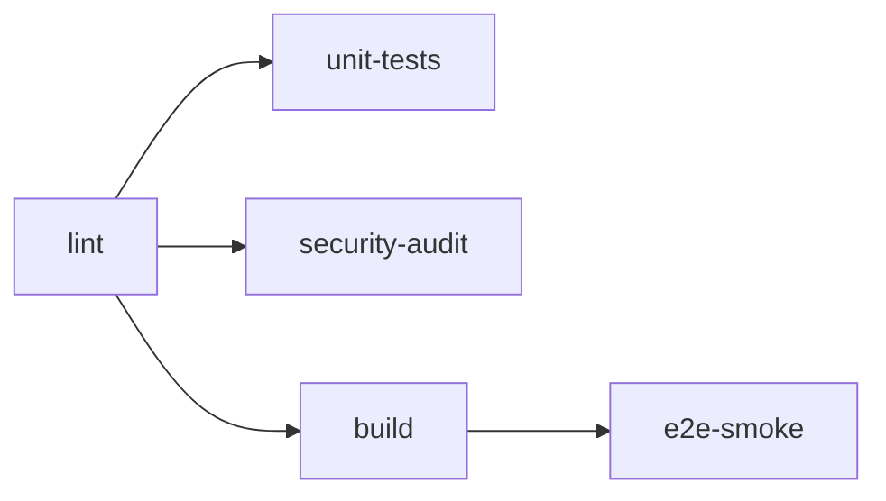

# 项目配置说明

> 本文档详细说明项目中所有配置文件的作用、关键字段和维护注意事项。

## 目录

- [运行环境](#运行环境)
- [包管理与依赖](#包管理与依赖)
- [Next.js 配置](#nextjs-配置)
- [TypeScript](#typescript)
- [CSS / Tailwind CSS](#css--tailwind-css)
- [代码质量工具链](#代码质量工具链)
- [测试工具链](#测试工具链)
- [Git 工作流](#git-工作流)
- [SEO 与 PWA](#seo-与-pwa)
- [安全策略](#安全策略)
- [CI/CD](#cicd)
- [部署（Vercel）](#部署vercel)
- [编辑器配置](#编辑器配置)
- [环境变量](#环境变量)
- [目录结构概览](#目录结构概览)

---

## 运行环境

### `.nvmrc`

指定项目使用的 Node.js 版本，确保团队开发环境一致：

```
20.18.0
```

配合 [nvm](https://github.com/nvm-sh/nvm) 使用：`nvm use` 即可自动切换。

### `package.json` — engines 字段

```json
{
  "engines": {
    "node": ">=20",
    "pnpm": ">=9"
  },
  "packageManager": "pnpm@10.30.3+sha512.c961..."
}
```

- `engines` 与 `.npmrc` 中的 `engine-strict=true` 配合，当 Node 或包管理器版本不满足时会直接报错阻止安装
- `packageManager` 字段锁定 pnpm 精确版本（含 SHA-512），通过 Corepack 自动安装

---

## 包管理与依赖

### `.npmrc`

```properties
engine-strict=true          # 强制检查 engines 字段
auto-install-peers=true     # 自动安装 peer dependencies
shamefully-hoist=true       # 提升依赖到根目录（兼容某些包的 require 行为）
save-exact=false            # 安装时不锁定精确版本（使用 ^ 前缀）
# registry=https://registry.npmmirror.com  # 淘宝镜像（中国地区可按需启用）
```

### `pnpm-workspace.yaml`

```yaml
onlyBuiltDependencies:
  - sharp
  - unrs-resolver
```

限制只有 `sharp`（图片处理）和 `unrs-resolver` 会执行 postinstall 构建脚本，加速其他依赖安装。

### 核心依赖一览

| 依赖                                                   | 版本      | 用途                                     |
| ------------------------------------------------------ | --------- | ---------------------------------------- |
| `next`                                                 | 16.1.6    | React 全栈框架                           |
| `react` / `react-dom`                                  | 19.2.3    | UI 渲染                                  |
| `framer-motion`                                        | ^12.23.26 | 动画引擎                                 |
| `zustand`                                              | ^5.0.9    | 轻量状态管理                             |
| `tailwindcss`                                          | ^4        | 原子化 CSS（v4 新架构）                  |
| `lucide-react`                                         | ^0.562.0  | 图标库                                   |
| `react-markdown`                                       | ^10.1.0   | Markdown 渲染                            |
| `react-syntax-highlighter`                             | ^16.1.0   | 代码高亮                                 |
| `katex` + `rehype-katex` + `remark-math`               | —         | 数学公式渲染                             |
| `rehype-slug` + `remark-gfm` + `remark-toc`            | —         | Markdown 增强（标题锚点、GFM、自动目录） |
| `@radix-ui/*`                                          | —         | 无障碍 UI 基元（Slider、Tooltip、Slot）  |
| `class-variance-authority` + `clsx` + `tailwind-merge` | —         | 样式变体与类名合并工具                   |

### 开发依赖亮点

| 依赖                     | 版本    | 用途                  |
| ------------------------ | ------- | --------------------- |
| `vitest`                 | ^4.0.18 | 单元测试框架          |
| `@vitest/coverage-v8`    | ^4.0.18 | 覆盖率（V8 Provider） |
| `@playwright/test`       | ^1.58.2 | E2E 端到端测试        |
| `@testing-library/react` | ^16.3.2 | React 组件测试工具    |
| `jsdom`                  | 27.0.1  | 浏览器 DOM 模拟       |
| `eslint`                 | ^9      | 代码质量检查          |
| `prettier`               | ^3.7.4  | 代码格式化            |
| `husky`                  | ^9.1.7  | Git 钩子管理          |
| `lint-staged`            | ^16.2.7 | 暂存区文件自动处理    |
| `commitizen` + `cz-git`  | —       | 交互式规范提交        |

### 脚本说明

#### 开发与构建

| 脚本         | 说明                                                         |
| ------------ | ------------------------------------------------------------ |
| `pnpm dev`   | 启动开发服务器（自动先执行 `predev` 生成搜索数据和动态导入） |
| `pnpm build` | 生产构建（自动先执行 `prebuild`）                            |
| `pnpm start` | 启动生产服务器                                               |

#### 代码质量

| 脚本                | 说明                     |
| ------------------- | ------------------------ |
| `pnpm lint`         | ESLint 检查              |
| `pnpm lint:fix`     | ESLint 自动修复          |
| `pnpm format`       | Prettier 格式化          |
| `pnpm format:check` | Prettier 格式检查        |
| `pnpm commit`       | 交互式规范提交（cz-git） |

#### 代码生成与校验

| 脚本                            | 说明                     |
| ------------------------------- | ------------------------ |
| `pnpm generate:search-data`     | 生成搜索数据 JSON        |
| `pnpm generate:problem-loaders` | 生成算法题目动态导入文件 |
| `pnpm validate:content`         | 校验内容一致性           |
| `pnpm validate:content:strict`  | 严格模式校验内容一致性   |

#### 开源导出

| 脚本                            | 说明                                                               |
| ------------------------------- | ------------------------------------------------------------------ |
| `pnpm oss:export`               | 将当前私有仓库导出到 `bare-algorithm/`，采用增量同步并保留 `.git/` |
| `pnpm oss:export:skip-validate` | 执行开源导出但跳过内容一致性校验，适合本地快速预览导出结果         |

#### 测试

| 脚本                         | 说明                                                    |
| ---------------------------- | ------------------------------------------------------- |
| `pnpm test`                  | 运行单元测试（等同于 `test:unit`）                      |
| `pnpm test:unit`             | Vitest 单次运行                                         |
| `pnpm test:unit:watch`       | Vitest 监听模式                                         |
| `pnpm test:coverage`         | Vitest 运行并生成覆盖率报告                             |
| `pnpm test:unit:report`      | 运行单元测试 + 覆盖率，输出 JSON 报告到 `test-results/` |
| `pnpm test:e2e:smoke`        | Playwright 冒烟测试（仅运行 `@smoke` 标记的用例）       |
| `pnpm test:report:visualize` | 生成测试结果可视化报告                                  |
| `pnpm test:workflow`         | 一键执行完整测试工作流（单元 → E2E → 可视化报告）       |

#### 安全审计

| 脚本                     | 说明                                                          |
| ------------------------ | ------------------------------------------------------------- |
| `pnpm security:audit`    | 运行安全审计（依赖漏洞 + 密钥检测 + 许可证合规 + 安全头验证） |
| `pnpm security:audit:ci` | CI 模式安全审计（失败时退出码非零）                           |

#### 性能分析

| 脚本                         | 说明                                                    |
| ---------------------------- | ------------------------------------------------------- |
| `pnpm perf:drilldown`        | 交互式性能深钻分析                                      |
| `pnpm perf:drilldown:headed` | 有头模式性能深钻（可观察浏览器）                        |
| `pnpm perf:report:visualize` | 生成性能报告可视化                                      |
| `pnpm perf:full`             | 完整性能分析流水线（Lighthouse → 对比 → 可视化 → 深钻） |

#### 打包体积分析

| 脚本                          | 说明                                                |
| ----------------------------- | --------------------------------------------------- |
| `pnpm build:analyze`          | 带分析器构建（`ANALYZE=true next build --webpack`） |
| `pnpm bundle:snapshot:before` | 保存 before 快照（需已有 `.next/analyze/` 产物）    |
| `pnpm bundle:snapshot:after`  | 保存 after 快照                                     |
| `pnpm bundle:analyze:before`  | 构建并保存 before 快照（一步到位）                  |
| `pnpm bundle:analyze:after`   | 构建并保存 after 快照（一步到位）                   |
| `pnpm bundle:compare`         | 生成 before vs after 对比报告（HTML/SVG/MD/JSON）   |
| `pnpm bundle:refresh:compare` | after 构建 + 快照 + 对比报告一步到位                |

> 打包分析依赖 `@next/bundle-analyzer`（已在 devDependencies），通过 `next.config.ts` 中的 `withBundleAnalyzer` 集成。使用 `--webpack` flag 强制走 Webpack 打包（Next.js 16 默认使用 Turbopack）。快照保存在 `docs/performance/bundle-analysis/` 下，报告包含入口点级别 Parsed/Gzip 对比图和 Chunk 明细表。详见 [docs/performance/性能分析工作流.md](./performance/性能分析工作流.md)。

---

## Next.js 配置

### `next.config.ts`

```ts
import type { NextConfig } from 'next';

const nextConfig: NextConfig = {
  experimental: {
    optimizePackageImports: ['framer-motion', 'lucide-react'],
  },
  async headers() {
    return [
      {
        source: '/(.*)',
        headers: [
          // 安全头部（详见"安全策略"章节）
        ],
      },
    ];
  },
};

export default nextConfig;
```

**关键点**：

- `optimizePackageImports` — 对 `framer-motion` 和 `lucide-react` 启用自动 barrel 优化，避免导入整个包
- 安全头部通过 `headers()` 函数全局注入（匹配 `/(.*)`，覆盖所有路由）

---

## TypeScript

### `tsconfig.json`

```json
{
  "compilerOptions": {
    "target": "ES2017",
    "lib": ["dom", "dom.iterable", "esnext"],
    "allowJs": true,
    "skipLibCheck": true,
    "strict": true,
    "noEmit": true,
    "esModuleInterop": true,
    "module": "esnext",
    "moduleResolution": "bundler",
    "resolveJsonModule": true,
    "isolatedModules": true,
    "jsx": "react-jsx",
    "incremental": true,
    "plugins": [{ "name": "next" }],
    "paths": {
      "@/*": ["./src/*"]
    }
  },
  "include": [
    "next-env.d.ts",
    "**/*.ts",
    "**/*.tsx",
    ".next/types/**/*.ts",
    ".next/dev/types/**/*.ts",
    "**/*.mts"
  ],
  "exclude": ["node_modules"]
}
```

**关键点**：

| 选项                            | 说明                                             |
| ------------------------------- | ------------------------------------------------ |
| `strict: true`                  | 启用所有严格类型检查                             |
| `moduleResolution: "bundler"`   | Next.js 推荐的模块解析方式                       |
| `jsx: "react-jsx"`              | React 17+ 的 JSX Transform（无需手动导入 React） |
| `incremental: true`             | 增量编译，加速 `tsc` 类型检查                    |
| `noEmit: true`                  | 仅做类型检查，不输出编译产物（由 Next.js 处理）  |
| `isolatedModules: true`         | 确保每个文件可被独立转译                         |
| `plugins: [{ "name": "next" }]` | Next.js 编辑器类型增强                           |
| `@/*` 别名                      | 指向 `src/` 目录                                 |

---

## CSS / Tailwind CSS

### Tailwind CSS v4 架构

项目使用 **Tailwind CSS v4**，不再使用传统的 `tailwind.config.js`，而是通过 CSS 原生配置：

#### `postcss.config.mjs`

```js
const config = {
  plugins: {
    '@tailwindcss/postcss': {},
  },
};

export default config;
```

#### `src/app/globals.css`

```css
@import 'tailwindcss';
@import 'tw-animate-css';
@plugin "@tailwindcss/typography";

@custom-variant dark (&:is(.dark *));

@theme inline {
  /* shadcn/ui 设计 token 映射（颜色、圆角等） */
}
```

### shadcn/ui 配置

#### `components.json`

```json
{
  "$schema": "https://ui.shadcn.com/schema.json",
  "style": "new-york",
  "rsc": true,
  "tsx": true,
  "tailwind": {
    "config": "",
    "css": "src/app/globals.css",
    "baseColor": "zinc",
    "cssVariables": true,
    "prefix": ""
  },
  "iconLibrary": "lucide",
  "aliases": {
    "components": "@/components",
    "utils": "@/lib/utils",
    "ui": "@/components/ui",
    "lib": "@/lib",
    "hooks": "@/hooks"
  },
  "registries": {}
}
```

**关键点**：

- `style: "new-york"` — 使用 New York 风格变体
- `iconLibrary: "lucide"` — 指定 Lucide 作为图标库
- `aliases` — 定义了 5 个路径别名，覆盖组件、工具库、UI 基础组件、底层库及 Hooks

### 自定义设计 Token

在 `globals.css` 中定义了算法可视化专用的 CSS 变量：

| 变量                   | 值（Light）              | 用途                        |
| ---------------------- | ------------------------ | --------------------------- |
| `--algo-primary`       | `oklch(0.7 0.2 260)`     | 科技风强调色（蓝紫霓虹）    |
| `--algo-primary-glow`  | `oklch(0.7 0.2 260/30%)` | 强调色辉光（30% 透明度）    |
| `--algo-default`       | `oklch(0.3 0.02 260)`    | 默认/未激活元素             |
| `--algo-active`        | `oklch(0.6 0.25 260)`    | 当前激活元素                |
| `--algo-comparing`     | `oklch(0.75 0.2 80)`     | 比较中的元素                |
| `--algo-success`       | `oklch(0.7 0.2 145)`     | 已完成/正确的元素           |
| `--algo-error`         | `oklch(0.65 0.25 25)`    | 错误状态                    |
| `--algo-visited`       | `oklch(0.5 0.15 300)`    | 已访问节点（图算法）        |
| `--algo-pointer-1/2/3` | 蓝/粉/绿三色             | 指针/标记颜色（多指针区分） |

> 暗色模式下 `--algo-default` 和 `--algo-active` 会自动覆盖为适配暗背景的值。

---

## 代码质量工具链

### ESLint — `eslint.config.mjs`

使用 **ESLint v9** 新的 Flat Config 格式：

```js
import nextVitals from 'eslint-config-next/core-web-vitals';
import nextTs from 'eslint-config-next/typescript';
import prettierConfig from 'eslint-config-prettier';
import { defineConfig, globalIgnores } from 'eslint/config';

const eslintConfig = defineConfig([
  ...nextVitals, // Next.js Core Web Vitals 规则
  ...nextTs, // Next.js TypeScript 规则
  prettierConfig, // 禁用与 Prettier 冲突的规则（放最后）
  {
    rules: {
      '@typescript-eslint/no-unused-vars': [
        'error',
        { argsIgnorePattern: '^_', varsIgnorePattern: '^_' },
      ],
    },
  },
  globalIgnores(['.next/**', 'out/**', 'build/**', '.tmp-*/**', 'next-env.d.ts']),
]);
```

### Prettier — `.prettierrc`

```json
{
  "semi": true,
  "singleQuote": true,
  "trailingComma": "es5",
  "printWidth": 100,
  "tabWidth": 2,
  "plugins": ["@ianvs/prettier-plugin-sort-imports"],
  "importOrder": ["^react$", "^next", "<THIRD_PARTY_MODULES>", "", "^@/(.*)$", "^[./]"]
}
```

**导入排序规则**：`react` → `next` → 第三方 → 空行 → 项目内部 (`@/`) → 相对路径

### `.prettierignore`

排除：`.next`、`out`、`build`、`node_modules`、`pnpm-lock.yaml`、`package-lock.json`、`yarn.lock`。

### `.editorconfig`

统一跨编辑器的基本格式：

| 范围             | 规则                                               |
| ---------------- | -------------------------------------------------- |
| `[*]`            | UTF-8、LF 换行、2 空格缩进、末尾换行、裁剪尾随空白 |
| `[*.md]`         | **不**裁剪尾随空白（Markdown 的换行语法）          |
| `[*.{yml,yaml}]` | 2 空格缩进                                         |
| `[Makefile]`     | Tab 缩进                                           |

---

## 测试工具链

### Vitest — `vitest.config.ts`

```ts
import path from 'node:path';
import { defineConfig } from 'vitest/config';

export default defineConfig({
  resolve: {
    alias: { '@': path.resolve(__dirname, 'src') },
  },
  test: {
    globals: true,
    environment: 'jsdom',
    setupFiles: ['./tests/setup/vitest.setup.ts'],
    include: ['tests/**/*.test.{ts,tsx}'],
    coverage: {
      provider: 'v8',
      reporter: ['text', 'json-summary', 'html'],
      reportsDirectory: 'coverage',
      thresholds: {
        lines: 85,
        functions: 85,
        statements: 85,
        branches: 70,
      },
    },
  },
});
```

**关键点**：

| 配置                      | 说明                                       |
| ------------------------- | ------------------------------------------ |
| `globals: true`           | 全局注入 `describe`、`it`、`expect` 等 API |
| `environment: 'jsdom'`    | 使用 jsdom 模拟浏览器 DOM 环境             |
| `setupFiles`              | 测试初始化文件（如配置 Testing Library）   |
| `include`                 | 测试文件匹配 `tests/**/*.test.{ts,tsx}`    |
| `coverage.provider: 'v8'` | 使用 V8 原生覆盖率引擎                     |
| `coverage.thresholds`     | 覆盖率门槛：行/函数/语句 ≥ 85%，分支 ≥ 70% |

### Playwright — `playwright.config.ts`

```ts
import { defineConfig, devices } from '@playwright/test';

export default defineConfig({
  testDir: './tests/e2e',
  timeout: 45_000,
  fullyParallel: false,
  workers: process.env.CI ? 1 : undefined,
  outputDir: 'test-results/playwright/artifacts',
  reporter: [
    ['list'],
    ['json', { outputFile: 'test-results/playwright/results.json' }],
    ['html', { outputFolder: 'test-results/playwright/html-report', open: 'never' }],
  ],
  use: {
    baseURL: process.env.PLAYWRIGHT_BASE_URL ?? 'http://127.0.0.1:3001',
    trace: 'retain-on-failure',
    screenshot: 'only-on-failure',
    video: 'retain-on-failure',
  },
  webServer: process.env.PLAYWRIGHT_SKIP_WEBSERVER
    ? undefined
    : {
        command: 'pnpm dev --port 3001',
        url: 'http://127.0.0.1:3001',
        reuseExistingServer: !process.env.CI,
        timeout: 180_000,
      },
  projects: [{ name: 'chromium', use: devices['Desktop Chrome'] }],
});
```

**关键点**：

| 配置                          | 说明                                            |
| ----------------------------- | ----------------------------------------------- |
| `testDir: './tests/e2e'`      | E2E 测试文件目录                                |
| `timeout: 45_000`             | 单个测试超时 45 秒                              |
| `workers: CI ? 1 : undefined` | CI 环境单线程运行，本地自动并发                 |
| `trace/screenshot/video`      | 仅在失败时保留调试信息                          |
| `webServer`                   | 自动启动开发服务器（端口 3001，避免与开发冲突） |
| `PLAYWRIGHT_SKIP_WEBSERVER`   | 设为任意值可跳过自动启动（用于已有运行服务）    |

### 测试目录结构

```
tests/
├── components/           # React 组件测试（6 个文件）
├── lib/                  # 工具库测试（3 个文件）
├── scripts/              # 脚本测试（1 个文件）
├── e2e/                  # Playwright E2E 测试
└── setup/
    └── vitest.setup.ts   # Vitest 初始化配置
```

---

## Git 工作流

### Husky — `.husky/`

Git 钩子（需 `pnpm prepare` 初始化）：

| 钩子         | 文件                | 作用                           |
| ------------ | ------------------- | ------------------------------ |
| `pre-commit` | `.husky/pre-commit` | 执行 `lint-staged`             |
| `commit-msg` | `.husky/commit-msg` | 执行 `commitlint` 校验提交信息 |

### lint-staged — `.lintstagedrc.json`

```json
{
  "*.{js,jsx,ts,tsx}": ["eslint --fix", "prettier --write"],
  "*.{json,md,css,scss}": ["prettier --write"]
}
```

暂存区文件自动执行 ESLint 修复 + Prettier 格式化。

### CommitLint — `commitlint.config.js`

继承 `@commitlint/config-conventional`，定义了 15 种提交类型：

| 类型       | 说明         |
| ---------- | ------------ |
| `feat`     | ✨ 新功能    |
| `fix`      | 🐛 修复缺陷  |
| `docs`     | 📚 文档变动  |
| `style`    | 🎨 代码格式  |
| `refactor` | 📦 重构      |
| `perf`     | 🚀 性能优化  |
| `test`     | 🧪 测试用例  |
| `build`    | 👷 构建/依赖 |
| `ci`       | 🎡 CI 配置   |
| `chore`    | 🔧 杂项      |
| `revert`   | ⏪ 回滚      |
| `wip`      | 🚧 开发中    |
| `workflow` | 📋 工作流    |
| `types`    | 🏷️ 类型定义  |
| `release`  | 🎉 发版      |

**Scope 可选范围**：`app`、`components`、`ui`、`visualizer`、`shared`、`lib`、`problems`、`hooks`、`store`、`types`、`docs`、`build`

> 支持自定义 scope，也可跳过。Header 最大长度 108，Subject 最大长度 50。

使用方式：`pnpm commit` 进入交互式提交界面（cz-git，已启用 emoji）。

### `.gitignore`

主要忽略项：

| 分类            | 忽略路径                                                                      |
| --------------- | ----------------------------------------------------------------------------- |
| 依赖            | `node_modules`、`.pnp`、`.yarn/*`                                             |
| 构建产物        | `.next/`、`out/`、`build/`                                                    |
| 自动生成        | `search-data.json`、`problem-loaders.generated.ts`                            |
| 环境变量        | `.env*`                                                                       |
| TypeScript 缓存 | `*.tsbuildinfo`、`next-env.d.ts`                                              |
| 测试产物        | `coverage/`、`test-results/`                                                  |
| 性能测试产物    | `docs/performance/{baseline,optimized,drilldown,reports}/`                    |
| 安全审计产物    | `docs/security/audit-raw.json`、`docs/security/reports/`、`license-audit.csv` |
| 测试报告        | `docs/testing/reports/`                                                       |
| AI 工具临时文件 | `.tmp-*-skills`、`.tmp-chrome-run/`、`.tmp-cdp-profile-*/`                    |

---

## SEO 与 PWA

### `src/app/robots.ts`

自动生成 `robots.txt`：

- 允许所有爬虫抓取 `/`
- 屏蔽 `/api/` 和 `/demo/`
- 声明 sitemap 位置

### `src/app/sitemap.ts`

自动生成 `sitemap.xml`：

- 扫描 `src/lib/problems/` 下所有 `problem.json`
- 生成首页（priority 1.0）、分类页（0.8）、题目页（0.6）
- 支持通过 `NEXT_PUBLIC_SITE_URL` 环境变量配置站点域名

### `src/app/layout.tsx` — Metadata

```ts
export const metadata: Metadata = {
  metadataBase: new URL(process.env.NEXT_PUBLIC_SITE_URL || 'https://algo.example.com'),
  title: {
    default: '朴素算法',
    template: '%s | 朴素算法',
  },
  keywords: ['算法可视化', 'LeetCode', ...],
  openGraph: { ... },
  twitter: { card: 'summary_large_image', ... },
  icons: { icon: '/icon.png', apple: '/icon.png' },
};
```

### `src/app/manifest.ts` — PWA

生成 `manifest.webmanifest`，配置应用名称、图标、主题色、显示模式等，支持将站点作为 PWA 安装。

---

## 安全策略

### HTTP 安全头（`next.config.ts`）

| 头部                        | 值                                             | 作用                                 |
| --------------------------- | ---------------------------------------------- | ------------------------------------ |
| `X-Frame-Options`           | `DENY`                                         | 防止页面被 iframe 嵌入（防点击劫持） |
| `X-Content-Type-Options`    | `nosniff`                                      | 防止 MIME 类型嗅探                   |
| `Referrer-Policy`           | `strict-origin-when-cross-origin`              | 限制 Referer 泄露                    |
| `Permissions-Policy`        | `camera=(), microphone=(), geolocation=()`     | 禁用敏感浏览器 API                   |
| `Strict-Transport-Security` | `max-age=63072000; includeSubDomains; preload` | 强制 HTTPS（2 年有效期）             |
| `Content-Security-Policy`   | 见下方                                         | 内容安全策略                         |

**CSP 策略**：

```
default-src 'self';
script-src 'self' 'unsafe-inline' 'unsafe-eval';
style-src 'self' 'unsafe-inline';
img-src 'self' data: blob:;
font-src 'self' data:;
connect-src 'self' https:;
frame-ancestors 'none';
```

> 注意：`unsafe-inline` 和 `unsafe-eval` 是 Next.js 运行所需，后续可通过 nonce 进一步收紧。

### 安全审计脚本 — `scripts/security-audit.mjs`

通过 `pnpm security:audit` 执行一站式安全检查，覆盖：

- **依赖漏洞扫描** — 检查已知 CVE
- **密钥 / 敏感信息检测** — 扫描代码中的硬编码凭据
- **开源许可证合规** — 验证依赖的 License 兼容性
- **HTTP 安全头验证** — 确认部署后的响应头完整性

CI 模式（`--ci` 参数）在发现问题时返回非零退出码，可集成到流水线。

---

## CI/CD

### GitHub Actions — `.github/workflows/ci.yml`

在 `push`/`pull_request` 到 `main` 分支时触发，包含五个 Job：



#### `lint` Job — 代码质量检查

1. `pnpm install --frozen-lockfile`
2. `pnpm validate:content` — 内容一致性校验
3. `pnpm lint` — ESLint
4. `pnpm format:check` — Prettier 格式检查
5. `pnpm exec tsc --noEmit` — TypeScript 类型检查

#### `unit-tests` Job — 单元测试（依赖 `lint`）

1. `pnpm install --frozen-lockfile`
2. `pnpm test:unit:report` — 运行 Vitest 并生成覆盖率报告

#### `security-audit` Job — 安全审计（依赖 `lint`）

1. `pnpm install --frozen-lockfile`
2. `pnpm security:audit:ci` — 依赖漏洞 + 密钥检测 + 许可证合规 + 安全头验证

#### `build` Job — 构建验证（依赖 `lint`）

1. `pnpm install --frozen-lockfile`
2. `pnpm build` — 验证项目能正常构建

#### `e2e-smoke` Job — E2E 冒烟测试（依赖 `build`）

1. `pnpm install --frozen-lockfile`
2. `pnpm exec playwright install --with-deps chromium` — 安装 Chromium
3. `pnpm test:e2e:smoke` — 运行冒烟测试

**环境**：Ubuntu + Node 20 + pnpm 10

### 自动化工作流与治理 (GitHub Workflows)

除了核心的 `ci.yml` 构建验证流外，项目还启用了以下自动化后台策略服务（位于 `.github/` 与 `.github/workflows/` 下）：

| 工作流         | 文件名                               | 触发条件         | 核心作用                                                                                                                                                            |
| -------------- | ------------------------------------ | ---------------- | ------------------------------------------------------------------------------------------------------------------------------------------------------------------- |
| **Dependabot** | `dependabot.yml`                     | 每周/每月定时    | 自动扫描 npm 及 github-actions 依赖。有安全或小版本更新时，自动提交 `chore(deps)` 的 PR 供开发者合并，防范供应链投毒。                                              |
| **OSS Sync**   | `oss-sync.yml`                       | `main` 发生 push | 执行 `pnpm run oss:export` 生成 `bare-algorithm/` 快照，并将导出的公开仓库内容强制推送到目标 OSS 仓库。                                                             |
| **发版机器人** | `release.yml`                        | `main` 发生 push | 集成 `release-please-action`。分析 `cz-git` 生成的规范 Commit，当代码进入主分支时自动演算语义化版本（SemVer），修改版本号、维护 `CHANGELOG.md` 并生成 Release Tag。 |
| **僵尸清理机** | `stale.yml`                          | 每天定时         | 使用 `actions/stale` 自动查找 60 天无活动的 Issue 或 PR，打上 `stale` 标签。若 7 天内仍无回应则自动关闭，保持待办列表的整洁。                                       |
| **PR 标签器**  | `labeler.yml` / `labeler.yml` (配置) | 开启 PR 时       | 拦截来自任何开发者的修改，并根据他们修改的目录（如 `src/lib/problems`、`package.json`）自动为 PR 附带如 `core:algorithm` 或 `dx:deps` 标签分类。                    |

## 部署（Vercel）

### `vercel.json`

```json
{
  "$schema": "https://openapi.vercel.sh/vercel.json",
  "framework": "nextjs",
  "headers": [
    {
      "source": "/fonts/(.*)",
      "headers": [{ "key": "Cache-Control", "value": "public, max-age=31536000, immutable" }]
    },
    {
      "source": "/icon.png",
      "headers": [
        { "key": "Cache-Control", "value": "public, max-age=86400, stale-while-revalidate=604800" }
      ]
    }
  ],
  "rewrites": [],
  "redirects": []
}
```

| 资源     | 缓存策略                                 |
| -------- | ---------------------------------------- |
| 字体文件 | 1 年强缓存 + `immutable`                 |
| 图标文件 | 1 天缓存 + 7 天 `stale-while-revalidate` |

---

## 编辑器配置

### `.vscode/settings.json`

| 设置                        | 说明                                              |
| --------------------------- | ------------------------------------------------- |
| 保存时自动格式化 (Prettier) | `editor.formatOnSave: true`                       |
| 保存时自动 ESLint 修复      | `source.fixAll.eslint: "explicit"`                |
| Tab 大小 / 空格缩进         | `editor.tabSize: 2`，`editor.insertSpaces: true`  |
| 使用项目本地 TypeScript     | `typescript.tsdk: "node_modules/typescript/lib"`  |
| TypeScript 工作区提示       | `typescript.enablePromptUseWorkspaceTsdk: true`   |
| ESLint 验证语言             | JS、JSX、TS、TSX                                  |
| 文件编码 / 换行符           | UTF-8、LF                                         |
| CSS 文件关联 Tailwind       | `files.associations: { "*.css": "tailwindcss" }`  |
| Tailwind CSS CVA 正则       | 支持 `cva()` 和 `cx()` 中的类名补全               |
| 搜索排除                    | `node_modules`、`.next`、`pnpm-lock.yaml`         |
| 多语言 Formatter            | 所有 JS/TS/JSON/JSONC/MD/YAML/CSS 均使用 Prettier |

### `.vscode/extensions.json`

推荐安装的扩展：

| 扩展                                 | 作用                  |
| ------------------------------------ | --------------------- |
| `dbaeumer.vscode-eslint`             | ESLint 集成           |
| `esbenp.prettier-vscode`             | Prettier 格式化       |
| `editorconfig.editorconfig`          | EditorConfig 支持     |
| `ms-vscode.vscode-typescript-next`   | TypeScript Nightly    |
| `dsznajder.es7-react-js-snippets`    | React 代码片段        |
| `bradlc.vscode-tailwindcss`          | Tailwind CSS 智能提示 |
| `csstools.postcss`                   | PostCSS 语法支持      |
| `eamodio.gitlens`                    | Git 增强              |
| `formulahendry.auto-rename-tag`      | 自动重命名标签        |
| `christian-kohler.path-intellisense` | 路径智能提示          |

---

## 环境变量

### `.env.example`

```env
# ===========================
# 应用配置
# ===========================

# 站点 URL（用于生成 sitemap、Open Graph 等绝对路径）
NEXT_PUBLIC_SITE_URL=http://localhost:3000

# ===========================
# 可选：Analytics
# ===========================
# NEXT_PUBLIC_GA_ID=G-XXXXXXXXXX
```

新开发者加入时：

1. 复制 `.env.example` 为 `.env.local`
2. 按需修改变量值
3. `.env*` 已被 `.gitignore` 忽略，不会提交

---

## 目录结构概览

```
bare-algo/
├── .github/
│   ├── workflows/              # GitHub Actions 工作流
│   │   ├── ci.yml              # CI 流水线（5 个 Job）
│   │   ├── labeler.yml         # PR 自动分类标签
│   │   ├── release.yml         # Release Please 自动发版
│   │   └── stale.yml           # 陈旧 Issue/PR 自动清理
│   ├── dependabot.yml          # Dependabot 依赖更新配置
│   └── labeler.yml             # PR Labeler 路由规则配置
├── .husky/                     # Git 钩子（pre-commit + commit-msg）
├── .vscode/                    # 编辑器配置（settings + extensions）
├── docs/                       # 项目文档
│   ├── environment/            # 开发环境说明
│   ├── images/                 # 文档图片资源
│   ├── performance/            # 性能分析（报告自动生成）
│   ├── prompts/                # AI 提示词模板
│   ├── security/               # 安全审计（报告自动生成）
│   ├── testing/                # 测试框架说明与报告
│   ├── ui/                     # UI 设计文档
│   └── 项目配置说明.md         # 本文件
├── public/                     # 静态资源
│   └── barealgo.png            # 项目 Logo
├── scripts/                    # 构建/工具脚本
│   ├── generate-*.mjs          # 代码生成（搜索数据、动态导入）
│   ├── validate-*.mjs          # 内容校验
│   ├── perf-*.{mjs,ps1,json}   # 性能分析工具链
│   ├── bundle-*.mjs            # 打包体积分析（快照 + 对比报告）
│   ├── security-audit.mjs      # 安全审计脚本
│   └── test-report-visualize.mjs # 测试报告可视化
├── tests/                      # 测试文件
│   ├── components/             # React 组件测试
│   ├── lib/                    # 工具库测试
│   ├── scripts/                # 脚本测试
│   ├── e2e/                    # Playwright E2E 测试
│   └── setup/                  # Vitest 初始化配置
├── src/
│   ├── app/                    # Next.js App Router 页面
│   │   ├── globals.css         # 全局样式 + Tailwind 配置
│   │   ├── layout.tsx          # 根布局 + SEO Metadata
│   │   ├── manifest.ts         # PWA Manifest
│   │   ├── robots.ts           # robots.txt 生成
│   │   ├── sitemap.ts          # sitemap.xml 生成
│   │   ├── page.tsx            # 首页
│   │   ├── not-found.tsx       # 404 页
│   │   ├── demo/               # 分类浏览页面
│   │   └── problems/           # 算法题目路由
│   │       └── [category]/[problem]/
│   ├── components/             # React 组件
│   │   ├── shared/             # 共享组件（Navbar、BackButton 等）
│   │   ├── ui/                 # shadcn/ui 基础组件
│   │   └── visualizer/         # 可视化核心组件
│   ├── lib/                    # 工具库
│   │   ├── problems/           # 算法题目（23 个分类）
│   │   ├── hooks/              # 自定义 React Hooks
│   │   └── store/              # Zustand 状态管理
│   └── types/                  # TypeScript 类型定义
├── package.json                # 项目配置
├── next.config.ts              # Next.js 配置
├── tsconfig.json               # TypeScript 配置
├── eslint.config.mjs           # ESLint 配置（v9 Flat Config）
├── postcss.config.mjs          # PostCSS 配置
├── vitest.config.ts            # Vitest 单元测试配置
├── playwright.config.ts        # Playwright E2E 测试配置
├── commitlint.config.js        # Commitlint + cz-git 配置
├── components.json             # shadcn/ui 配置
├── vercel.json                 # Vercel 部署配置
├── .editorconfig               # 编辑器格式统一
├── .env.example                # 环境变量模板
├── .npmrc                      # pnpm 配置
├── .nvmrc                      # Node 版本
├── .prettierrc                 # Prettier 配置
├── .prettierignore             # Prettier 忽略
├── .lintstagedrc.json          # lint-staged 配置
├── .gitignore                  # Git 忽略
├── CONTRIBUTING.md             # 贡献指南
├── LICENSE                     # MIT 许可证
└── README.md                   # 项目说明
```
