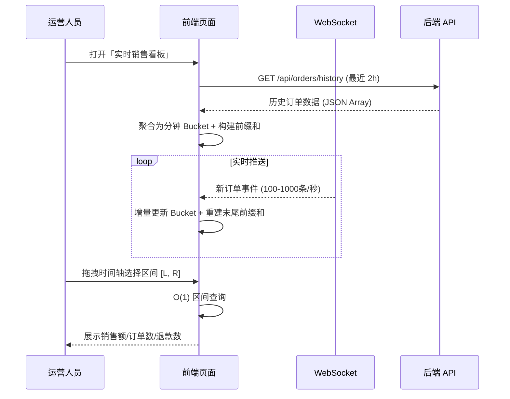

# 实时销售看板 - 前缀和与差分数组应用

## 一、背景与目标

### 1.1 行业背景

**电商平台运营后台** - 大促期间，运营/数据分析人员需要实时监控多维度销售数据，快速响应业务异常（如某品类销售骤降、退款激增）。

### 1.2 业务目标

- **实时性**: 秒级展示订单汇总数据
- **交互性**: 任意时间区间快速查询（< 16ms）
- **稳定性**: 高并发数据流下不阻塞 UI

---

## 二、角色与链路

### 2.1 角色定义

| 角色     | 职责                         | 核心诉求     |
| -------- | ---------------------------- | ------------ |
| 运营人员 | 监控销售趋势，发现异常并干预 | 快速区间查询 |
| 数据分析 | 导出时段数据，生成报表       | 准确聚合统计 |
| 风控系统 | 自动告警异常订单/退款        | 实时阈值检测 |

### 2.2 用户行为链路



---

## 三、数据来源与时序

### 3.1 数据来源

| 来源     | 协议      | 触发时机         | 数据量级       |
| -------- | --------- | ---------------- | -------------- |
| 历史接口 | REST API  | 页面初始化       | 10^4 - 10^5 条 |
| 实时推送 | WebSocket | 持续推送         | 100-1000 条/秒 |
| 滚动加载 | REST API  | 用户滚动查看历史 | 按页 1000 条   |

### 3.2 时序图

```
T=0s     页面加载 → 请求历史数据
T=2s     历史数据返回 → 构建前缀和 (< 50ms)
T=2s+    WebSocket 连接建立 → 持续接收事件
T=any    用户交互 → O(1) 区间查询
```

---

## 四、输入输出数据协议

### 4.1 订单事件 (输入)

```typescript
interface OrderEvent {
  orderId: string; // 订单ID (唯一标识)
  timestamp: number; // Unix 时间戳 (秒级)
  amount: number; // 金额 (分), 退款为负数
  categoryId?: string; // 商品类目, 可能缺失
  regionCode?: string; // 地区编码, 可能缺失
  isRefund?: boolean; // 退款标记
  userId?: string; // 用户ID
}
```

### 4.2 聚合 Bucket (中间结构)

```typescript
interface TimeBucket {
  timestamp: number; // 该分钟的起始时间戳
  totalAmount: number; // 销售额合计 (分)
  orderCount: number; // 订单数
  refundCount: number; // 退款笔数
}
```

### 4.3 查询结果 (输出)

```typescript
interface RangeQueryResult {
  totalAmount: number;
  orderCount: number;
  refundCount: number;
  avgAmount: number;
  queryTimeMs: number; // 查询耗时
  warnings: string[]; // 异常提示
}
```

### 4.4 脏数据类型 (必须处理)

| 类型         | 示例                             | 处理策略                      |
| ------------ | -------------------------------- | ----------------------------- |
| **字段缺失** | `{ orderId: "x", amount: null }` | 使用默认值 0, 记录 dirtyCount |
| **重复数据** | 同 orderId 多次推送              | 按 orderId 去重, 保留最新     |
| **乱序到达** | timestamp 不递增                 | 按 timestamp 排序后插入       |
| **异常值**   | `amount: -999999` (非正常退款)   | 阈值过滤 + 告警               |
| **空字符串** | `regionCode: ""`                 | 转为 undefined                |

---

## 五、非功能约束

### 5.1 性能约束

| 约束项   | 目标值       | 说明                      |
| -------- | ------------ | ------------------------- |
| 数据量   | 10^5 级/小时 | 每分钟聚合为 1 个 Bucket  |
| 区间查询 | **< 16ms**   | 不阻塞 60fps 渲染帧       |
| 预处理   | **< 50ms**   | 不触发 Long Task (> 50ms) |
| 增量更新 | **< 5ms**    | 单条事件更新不阻塞        |
| 内存占用 | **< 10MB**   | 保留最近 24 小时数据      |

### 5.2 复杂度要求

| 操作       | 时间复杂度            | 说明              |
| ---------- | --------------------- | ----------------- |
| 构建前缀和 | O(N)                  | N = Bucket 数量   |
| 区间查询   | **O(1)**              | 核心优化点        |
| 单条更新   | O(1)                  | 仅更新末尾 Bucket |
| 批量更新   | O(1) 更新 + O(N) 重建 | 使用差分数组      |

### 5.3 主线程预算

- 单帧预算: 16.67ms (60fps)
- 单次计算上限: **50ms** (避免 Long Task)
- 超限策略: 使用 `requestIdleCallback` 分片 或 Web Worker

---

## 六、失败与降级策略

| 失败场景       | 检测方式                 | 降级策略                        |
| -------------- | ------------------------ | ------------------------------- |
| WebSocket 断连 | `onclose` / `onerror`    | 切换轮询 (5s 间隔) + Toast 提示 |
| 历史接口超时   | 5s timeout               | 加载本地缓存 (IndexedDB)        |
| 前缀和构建超时 | performance.now() > 50ms | 分片构建 + 骨架屏               |
| 内存超限       | `performance.memory`     | 丢弃最老数据 + 警告             |
| 脏数据过多     | dirtyCount > 5%          | 触发告警 + 日志上报             |

---

## 七、可观测性指标与埋点字段

### 7.1 性能指标

| 指标名         | 采集方式              | 阈值   |
| -------------- | --------------------- | ------ |
| TTI            | PerformanceObserver   | < 3s   |
| Long Task      | PerformanceObserver   | 0 次   |
| 查询耗时 P99   | 埋点上报              | < 16ms |
| 前缀和构建耗时 | performance.now()     | < 50ms |
| FPS            | requestAnimationFrame | > 55   |

### 7.2 埋点字段

```typescript
interface AnalyticsLog {
  traceId: string; // 链路追踪 ID
  batchId: string; // 批次 ID (WebSocket 推送批次)
  eventType: 'query' | 'build' | 'update' | 'error';
  costMs: number; // 操作耗时
  dataCount: number; // 处理数据量
  droppedCount: number; // 丢弃的重复/异常数据量
  dirtyCount: number; // 脏数据量
  memoryUsage?: number; // 内存占用 (bytes)
  timestamp: number;
}
```

---

## 八、测试范围与边界用例

### 8.1 单元测试边界用例 (≥ 8 条)

| #   | 用例描述               | 输入                         | 预期输出                    |
| --- | ---------------------- | ---------------------------- | --------------------------- |
| 1   | 空数组查询             | `buckets=[], range=[0,0]`    | 返回全 0, 无异常            |
| 2   | 单元素查询             | `buckets=[{amount:100}]`     | `totalAmount=100`           |
| 3   | 全区间查询             | `range=[0, N-1]`             | 等于所有 bucket 之和        |
| 4   | 边界索引 L=R           | `range=[5, 5]`               | 返回第 5 个 bucket 的值     |
| 5   | 含负数 (退款)          | `amounts=[100, -50, 200]`    | `totalAmount=250`           |
| 6   | 全部为负               | `amounts=[-100, -200]`       | `totalAmount=-300`          |
| 7   | 超大数据 (10^5)        | 10 万条数据                  | 构建 < 50ms, 查询 < 1ms     |
| 8   | 重复 orderId 去重      | 相同 orderId 两次推送        | 只保留一条                  |
| 9   | 乱序 timestamp         | `[t2, t1, t3]` 无序到达      | 正确排序聚合                |
| 10  | 字段缺失 (amount=null) | `{orderId:"x", amount:null}` | amount 视为 0, dirtyCount+1 |

---

## 九、既有解决方案对比

### 方案 A: 暴力遍历

**适用场景**: 数据量 < 1000, 查询频率低

**核心思路**:

```
rangeSum(L, R) = for i in [L, R]: sum += arr[i]
```

**复杂度**: 查询 O(N), 更新 O(1)

**实现要点**:

- 直接遍历原数组
- 无需额外空间

**常见坑**: 大数据量时查询卡顿; 高频查询时主线程阻塞

---

### 方案 B: 前缀和数组

**适用场景**: 查询频繁, 数据相对稳定

**核心思路**:

```
预处理: prefix[i] = prefix[i-1] + arr[i-1]
查询:   rangeSum(L, R) = prefix[R+1] - prefix[L]
```

**复杂度**: 预处理 O(N), 查询 **O(1)**, 更新 O(N)

**实现要点**:

- 维护额外 prefix 数组 (空间 O(N))
- 数据变化后需重建整个 prefix

**常见坑**:

- 更新时需全量重建
- 负数索引/越界未处理

---

### 方案 C: 差分数组 + 前缀和

**适用场景**: 需要批量区间更新 + 区间查询

**核心思路**:

```
批量更新 [L,R] 加 val:
  diff[L] += val
  diff[R+1] -= val
还原: arr = prefix(diff)
查询: 使用方案 B 的 prefix 数组
```

**复杂度**: 批量更新 O(1), 还原 O(N), 查询 O(1)

**实现要点**:

- 维护 diff 数组记录变化量
- 查询前需 O(N) 还原

**常见坑**:

- 频繁查询时还原成本高
- 需要权衡更新与查询频率

---

### 方案 D: 线段树 (Segment Tree)

**适用场景**: 动态更新 + 高频查询

**核心思路**:

```
构建: 递归建树, 每个节点存区间和
更新: 自底向上更新路径 O(log N)
查询: 分治查询区间 O(log N)
```

**复杂度**: 构建 O(N), 单点更新 O(log N), 区间查询 O(log N)

**实现要点**:

- 使用数组模拟完全二叉树
- 支持懒更新 (Lazy Propagation)

**常见坑**:

- 实现复杂, 易出错
- 空间占用约 4N
- 对于简单场景过度设计

---

## 十、方案对比表

| 维度           | 暴力遍历   | 前缀和     | 差分+前缀和 | 线段树     |
| -------------- | ---------- | ---------- | ----------- | ---------- |
| **正确性**     | ⭐⭐⭐⭐⭐ | ⭐⭐⭐⭐⭐ | ⭐⭐⭐⭐⭐  | ⭐⭐⭐⭐   |
| **查询性能**   | ⭐         | ⭐⭐⭐⭐⭐ | ⭐⭐⭐⭐    | ⭐⭐⭐⭐   |
| **更新性能**   | ⭐⭐⭐⭐⭐ | ⭐         | ⭐⭐⭐      | ⭐⭐⭐⭐   |
| **实现复杂度** | ⭐⭐⭐⭐⭐ | ⭐⭐⭐⭐   | ⭐⭐⭐      | ⭐         |
| **可维护性**   | ⭐⭐⭐⭐⭐ | ⭐⭐⭐⭐   | ⭐⭐⭐      | ⭐⭐       |
| **扩展性**     | ⭐         | ⭐⭐⭐     | ⭐⭐⭐⭐    | ⭐⭐⭐⭐⭐ |
| **主线程影响** | ⭐         | ⭐⭐⭐⭐   | ⭐⭐⭐      | ⭐⭐⭐⭐   |

---

## 十一、推荐方案与理由

### ✅ 推荐: 方案 B + C 组合 (前缀和 + 差分数组)

**理由**:

1. **查询性能最优**: O(1) 区间查询满足 < 16ms 约束
2. **批量更新支持**: 差分数组支持 O(1) 批量区间更新
3. **实现简单**: 相比线段树, 代码量少 50%, 易维护
4. **增量更新策略**:
   - 单条新数据: 仅更新末尾 Bucket, 局部重建 prefix
   - 批量促销调整: 使用 diff 数组, 查询前还原

**关键接口定义**:

```typescript
// 构建前缀和
function buildPrefixSum(buckets: TimeBucket[]): PrefixSumArrays;

// O(1) 区间查询
function rangeQuery(prefix: PrefixSumArrays, L: number, R: number): RangeQueryResult;

// 差分数组批量更新
function batchUpdate(diff: number[], L: number, R: number, delta: number): void;

// 还原原数组
function applyDiff(diff: number[]): number[];
```

**关键步骤**:

1. 初始化: 加载历史数据 → 聚合为 Bucket → 构建 prefix (一次性 O(N))
2. 实时更新: WebSocket 事件 → 更新 Bucket → 仅重建受影响的 prefix 后缀
3. 用户查询: `prefix[R+1] - prefix[L]` (O(1))
4. 批量调整: 使用 diff 数组 → 查询时先 apply (按需)

---

## 十二、文件结构

```
chart-analytics/
├── page.tsx                    # 页面入口 (仅组合)
├── types.ts                    # 类型定义
├── constants.ts                # 配置 + 模拟数据生成
├── README.md                   # 本文档
├── services/
│   └── analytics.api.ts        # 前缀和/差分算法 (纯函数)
├── hooks/
│   └── useChartAnalytics.ts    # 状态管理 Hook
└── components/
    ├── TimeSeriesChart.tsx     # 时序柱状图
    ├── RangeSelector.tsx       # 区间选择器
    ├── StatsPanel.tsx          # 统计结果面板
    └── PerformanceMetrics.tsx  # 性能指标展示
```
